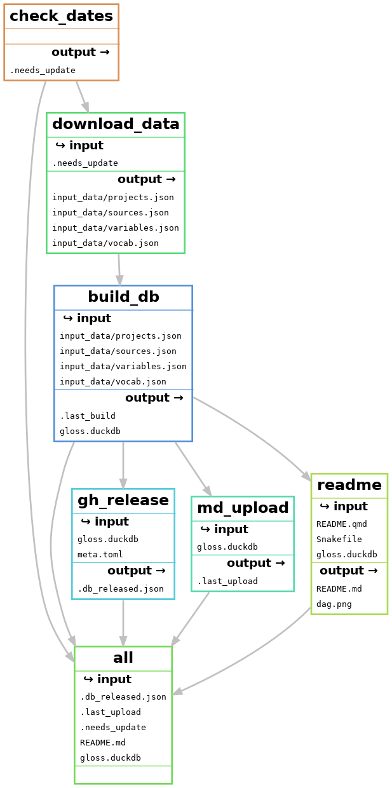

# data dictionary


# readme

``` bash
duckdb -c "
    SELECT table_name, count(*) AS num_columns
    FROM information_schema.columns
    GROUP BY table_name
    ORDER BY table_name;
" dict.duckdb
```

    ┌────────────┬─────────────┐
    │ table_name │ num_columns │
    │  varchar   │    int64    │
    ├────────────┼─────────────┤
    │ projects   │           3 │
    │ sources    │           8 │
    │ variables  │          10 │
    │ vocab      │           7 │
    └────────────┴─────────────┘

``` bash
snakemake --filegraph | dot -T png > dag.png
```

    Building DAG of jobs...


